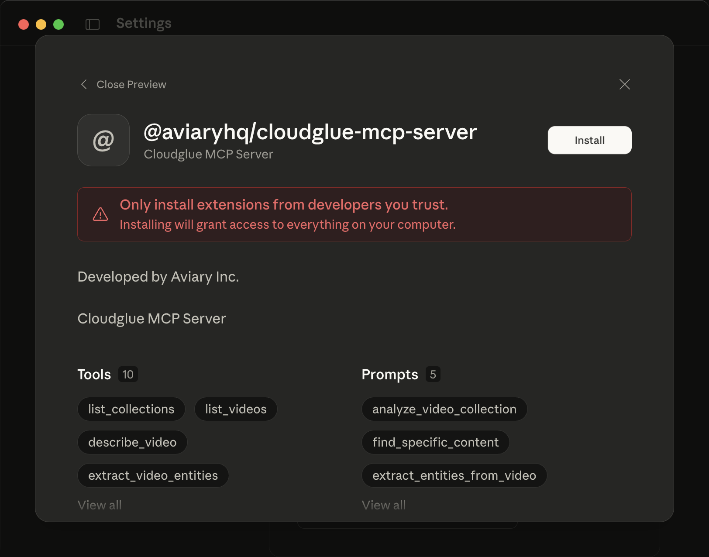
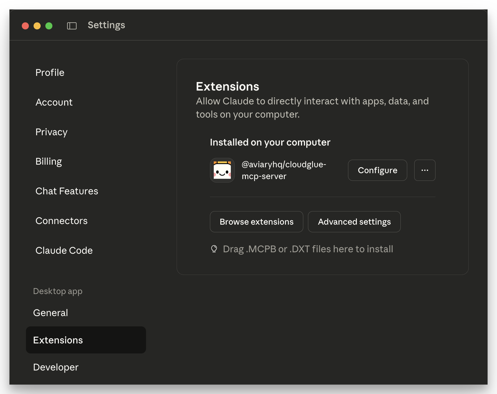

# Cloudglue MCP Server

[](https://www.npmjs.com/package/@aviaryhq/cloudglue-mcp-server)
[](LICENSE.md)

[](https://discord.gg/QD5KWFVner)

Connect Cloudglue to Cursor, Claude Desktop, and other AI assistants to unlock the power of video collection understanding. Cloudglue helps turn your videos into structured data ready for LLMs.

# 📖 Resources

- [Model Context Protocol](https://modelcontextprotocol.io/introduction)
- [Cloudglue API Docs](https://docs.cloudglue.dev)
- [Terms of Service](https://cloudglue.dev/terms)
- [Privacy Policy](https://cloudglue.dev/privacy)
- [Pricing](https://cloudglue.dev/pricing)

> By using the Cloudglue SDK and/or the MCP server, you agree to the [Cloudglue Terms of Service](https://cloudglue.dev/terms) and acknowledge our [Privacy Policy](https://cloudglue.dev/privacy).

# Usage

## Prerequisites

First, get a Cloudglue API Key from [cloudglue.dev](http://cloudglue.dev), this will be used to authenticate the MCP server with your Cloudglue account.

### A. On any MCP client using a JSON configuration

Most MCP clients store their configuration as JSON. For `cloudglue-mcp-server` this would look like the following:

```json
{
  "mcpServers": {
    "cloudglue": {
      "command": "npx",
      "args": [
        "-y",
        "@aviaryhq/cloudglue-mcp-server@latest",
        "--api-key",
        "<CLOUDGLUE-YOUR-API-KEY>"
      ]
    }
  }
}
```

Replace `<CLOUDGLUE-YOUR-API-KEY>` with the API Key created earlier.

### B. On Claude Desktop using Desktop Extensions

<div style="display: flex; gap: 10px; align-items: center;">
  
  
</div>

1. Download the latest Cloudglue Claude Desktop Extension (cloudglue-mcp-server.mcpb) from [the releases page](https://github.com/aviaryhq/cloudglue-mcp-server/releases/)
2. Double click to open with Claude Desktop (you need to have Claude Desktop running prior to this)
3. Click 'Install'
4. When prompted, enter your API key
5. Enable the extension

# Local Development

## Prerequisites

First, get a Cloudglue API Key from [cloudglue.dev](http://cloudglue.dev), this will be used to authenticate the MCP server with your Cloudglue account.

## Build the server

1. Clone the repo
2. Install dependencies using `npm install`
3. Build the server + Claude Desktop Extension using `npm build`

## Configure your MCP client

Next, configure your MCP client (such as Cursor) to use this server. Most MCP clients store the configuration as JSON in the following format:

```json
{
  "mcpServers": {
    "cloudglue-mcp-server": {
      "command": "node",
      "args": [
        "/ABSOLUTE/PATH/TO/PARENT/FOLDER/cloudglue-mcp-server/build/index.js",
        "--api-key",
        "<CLOUDGLUE-YOUR-API-KEY>"
      ]
    }
  }
}
```

# Documentation

## Tools

The following Cloudglue tools are available to LLMs through this MCP server:

### **Discovery & Navigation**

- **`list_collections`**: Discover available video collections and their basic metadata. Use this first to understand what video collections exist before using other collection-specific tools. Shows collection IDs needed for other tools, video counts, and collection types. **Pagination guidance**: For comprehensive exploration, paginate through all collections (check `has_more` and increment `offset` by `limit`) to ensure you don't miss any collections. Use smaller limits (5-10) for quick overviews, larger limits (25-50) for thorough exploration.

- **`list_videos`**: Browse and search video metadata with powerful filtering options. Use this to explore available videos, find specific content by date, or see what's in a collection. Returns essential video info like duration, filename, and IDs needed for other tools. **Pagination guidance**: For exhaustive exploration, paginate through all videos (check `has_more` and increment `offset` by `limit`) to ensure complete coverage. Use date filtering to focus on specific time periods, then paginate within those results.

### **Individual Video Analysis**

- **`describe_video`**: Get comprehensive transcripts and descriptions from individual videos with intelligent cost optimization. Automatically checks for existing transcripts before creating new ones. Use this for individual video analysis - for analyzing multiple videos in a collection, use retrieve_collection_descriptions instead. Supports YouTube URLs, Cloudglue URLs, and direct HTTP video URLs with different analysis levels.

- **`extract_video_entities`**: Extract structured data and entities from videos using custom prompts with intelligent cost optimization. Automatically checks for existing extractions before creating new ones. Use this for individual video analysis - for analyzing multiple videos in a collection, use retrieve_collection_entities instead. Supports YouTube URLs, Cloudglue URLs, and direct HTTP video URLs. The quality of results depends heavily on your prompt specificity.

- **`get_video_metadata`**: Get comprehensive technical metadata about a Cloudglue video file including duration, resolution, file size, processing status, and computed statistics. Use this when you need video specifications, file details, or processing information rather than content analysis. Different from content-focused tools like describe_video.

### **Collection Analysis**

- **`retrieve_summaries`**: Bulk retrieve video summaries and titles from a collection to quickly understand its content and themes. Works with both rich-transcripts and media-descriptions collections. Perfect for getting a high-level overview of what's in a collection, identifying common topics, or determining if a collection contains relevant content for a specific query. Use this as your first step when analyzing a collection - it's more efficient than retrieving full descriptions and helps you determine if you need more detailed information. Only proceed to retrieve_descriptions if you need the full multimodal context for specific videos identified through the summaries. For targeted content discovery, consider using search_video_summaries or search_video_moments instead of browsing through all summaries. **Pagination guidance**: For comprehensive collection analysis, paginate through all summaries (check `has_more` and increment `offset` by `limit`) to ensure complete coverage. Use larger limits (25-50) for efficient bulk analysis, smaller limits (5-10) for targeted exploration.

- **`retrieve_descriptions`**: Bulk retrieve rich multimodal descriptions (text, audio, and visual) from a collection with advanced filtering. Works with both rich-transcripts and media-descriptions collections. Use this only after using retrieve_summaries to identify specific videos that need detailed analysis. This tool is more resource-intensive and limited to 10 descriptions per request, so it's best used for targeted analysis of specific videos rather than broad collection overview. For single videos, use describe_video instead. Use date filtering to focus on specific time periods. For targeted content discovery, consider using search_video_moments or search_video_summaries instead of parsing through dense full descriptions. **Pagination guidance**: Due to the 10-item limit, pagination is essential for comprehensive analysis. Always check `has_more` and paginate through all descriptions when user intent requires exhaustive coverage. Use date filtering first to narrow scope, then paginate within filtered results.

- **`retrieve_entities`**: Batch retrieve structured entity data from multiple videos in a collection. Entities can be user-defined based on what's important for your collection (people, objects, concepts, custom categories). Perfect for data mining, building datasets, or analyzing previously extracted entities at scale. **Pagination guidance**: For comprehensive entity analysis, paginate through all entities (check `has_more` and increment `offset` by `limit`) to ensure complete data coverage. Use date filtering to focus on specific time periods, then paginate within those results. Essential for building complete datasets or performing exhaustive entity analysis.

- **`search_video_moments`**: AI-powered semantic search to find specific video segments within a collection. Uses Cloudglue's search API to locate relevant moments across speech, on-screen text, and visual descriptions. Returns structured search results with timestamps and metadata. Perfect for finding needle-in-haystack spoken and visual content, specific discussions, or thematic analysis.

- **`search_video_summaries`**: AI-powered semantic search to find relevant videos within a collection. Uses Cloudglue's search API to locate videos based on their content, summaries, and metadata. Works with rich-transcripts and media-descriptions collections. Returns structured search results with video information and relevance scores. Perfect for discovering videos by topic, theme, or content similarity.

### **Pagination Strategy**

**When to Paginate Exhaustively:**

- User asks for "all" or "complete" analysis of collections/videos
- User wants comprehensive coverage or exhaustive exploration
- User requests data mining, dataset building, or complete entity extraction
- User asks for "everything" in a collection or time period

**How to Paginate:**

1. Start with initial request (offset=0, appropriate limit)
2. Check response `pagination.has_more` field
3. If `has_more: true`, increment `offset` by `limit` and repeat
4. Continue until `has_more: false` or you have sufficient data
5. Use date filtering first to narrow scope, then paginate within results

**Limit Guidelines:**

- **Quick overviews**: 5-10 items
- **Comprehensive analysis**: 25-50 items
- **Exhaustive exploration**: Use maximum limits (50 for summaries, 10 for descriptions/entities)

### **When to Use Which Tool**

- **Start exploring**: Use `list_collections` and `list_videos` to explore available content
- **For single videos**: Use `describe_video` or `extract_video_entities`
- **For collection overview**: Always start with `retrieve_summaries` to efficiently understand what's in a collection
- **For detailed analysis**: Only use `retrieve_descriptions` for specific videos that need full multimodal context, identified through summaries
- **For structured data**: Use `retrieve_entities` for bulk entity extraction
- **For specific content**: Use `search_video_moments` for targeted segment search, `search_video_summaries` for video-level search
- **For technical specs**: Use `get_video_metadata`

All tools include intelligent features like cost optimization, automatic fallbacks, and comprehensive error handling.

## Contact

- [Open an Issue](https://github.com/aviaryhq/cloudglue-mcp-server/issues/new)
- [Email](mailto:support@cloudglue.dev)
